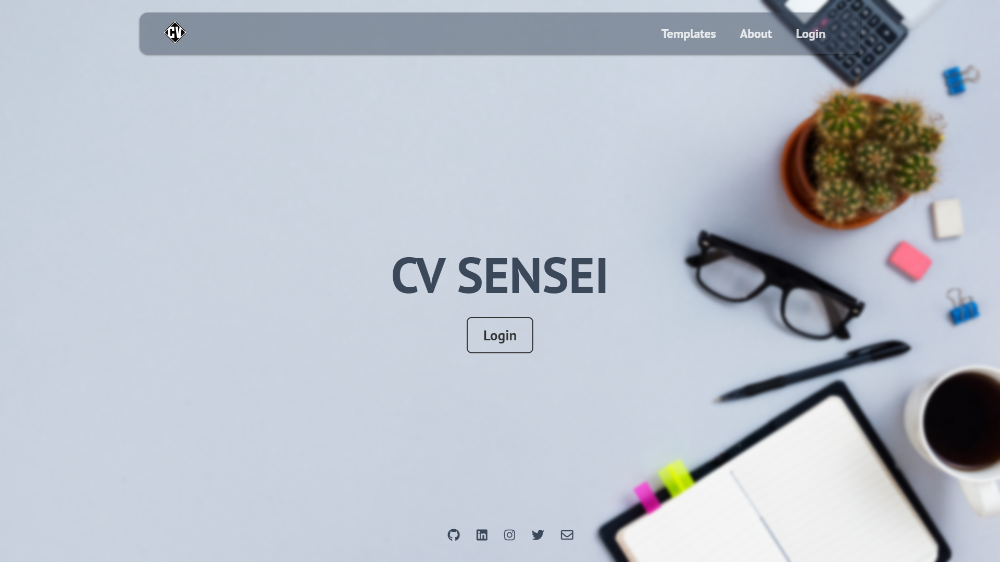
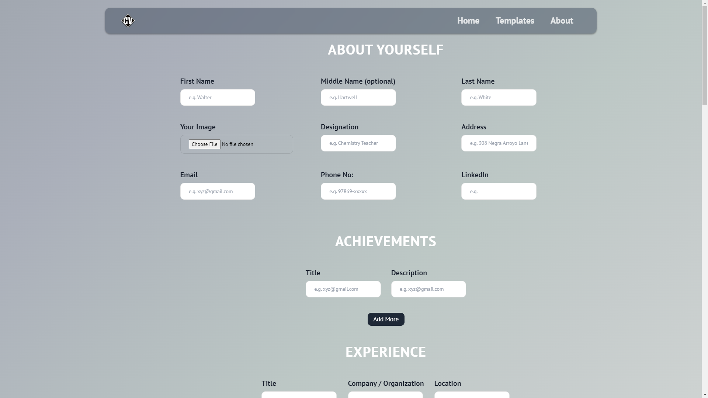
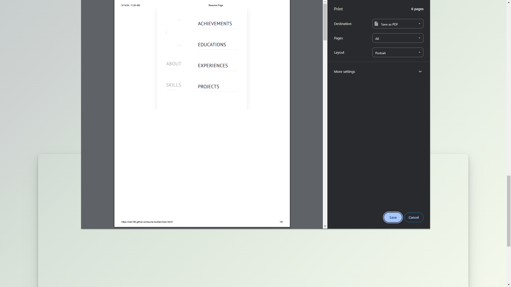
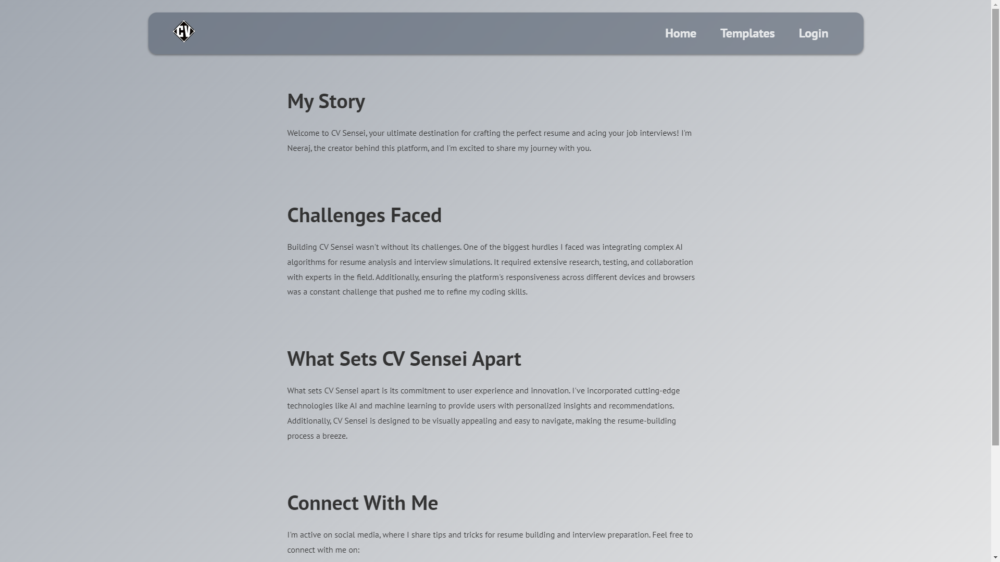
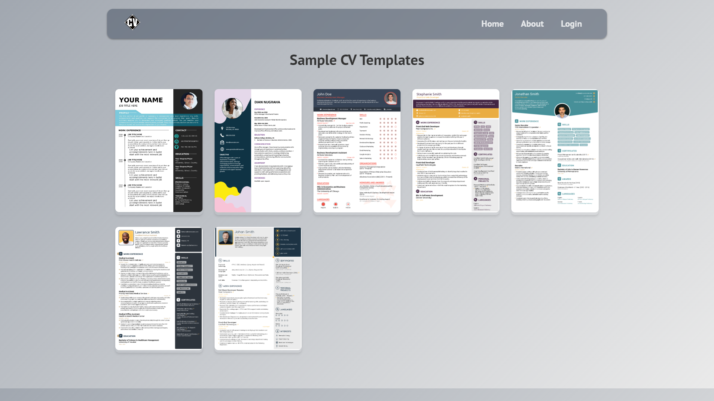
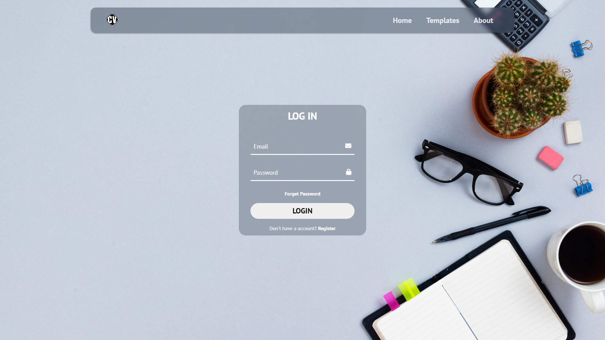
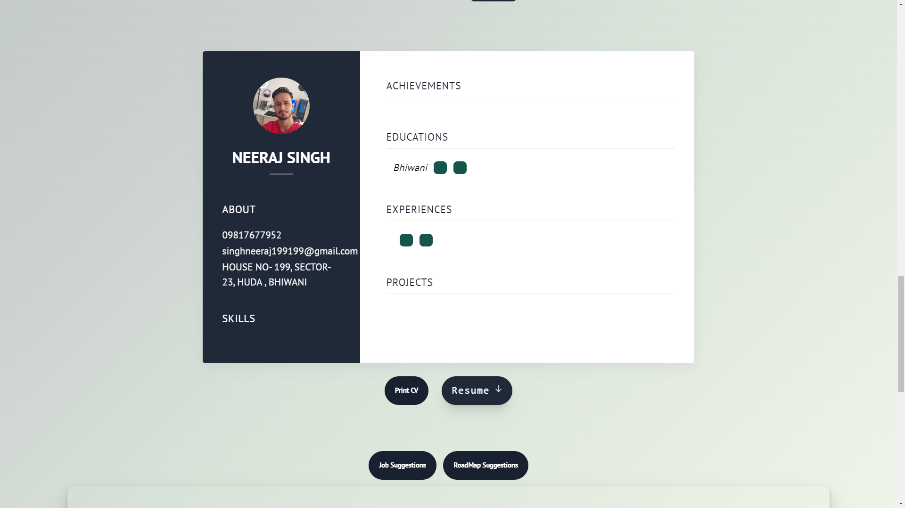
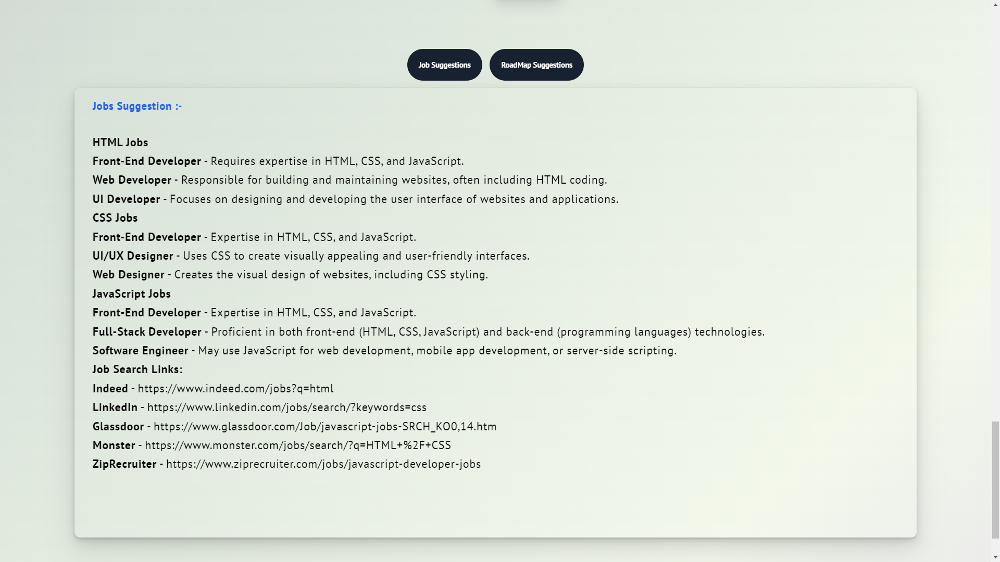

# CV Sensei

[Hosted Link](https://nsb199.github.io/resume-builder/)

CV Sensei is a resume building website with an amazing UI that allows users to create and download their resumes/CVs in PDF format.

## Screenshots

## Technologies Used
 HTML, CSS, JavaScript

## Difficulties Faced
Building CV Sensei presented several challenges, including:
- **PDF Generation:** Implementing PDF generation functionality required learning and integrating with PDFKit, which involved a learning curve.
- **Resume Structure:** Designing an intuitive user interface for building resumes while ensuring the correct structure and formatting was challenging but crucial for user experience.
- **Download Functionality:** Implementing the download functionality in a way that seamlessly integrates with the resume builder and generates a properly formatted PDF was a complex task.

## Extra Features
- Integration with additional job platforms and project repositories.
- Continuous improvement of AI algorithms for better resume analysis and interview simulation.
- Incorporation of natural language processing for more accurate feedback.
- User accounts and profiles for personalized experiences and progress tracking.

## Installation
1. Clone the repository: `git clone https://github.com/nsb199/resume-builder.git`
2. Open `index.html` in your browser.

## Usage
1. Build your resume using the intuitive resume builder.
2. Download your resume in PDF format for easy sharing and printing.
3. Track your progress and receive personalized job suggestions.

## Contributing
I welcome contributions to improve CV Sensei! Please fork this repository and submit a pull request with your changes.

